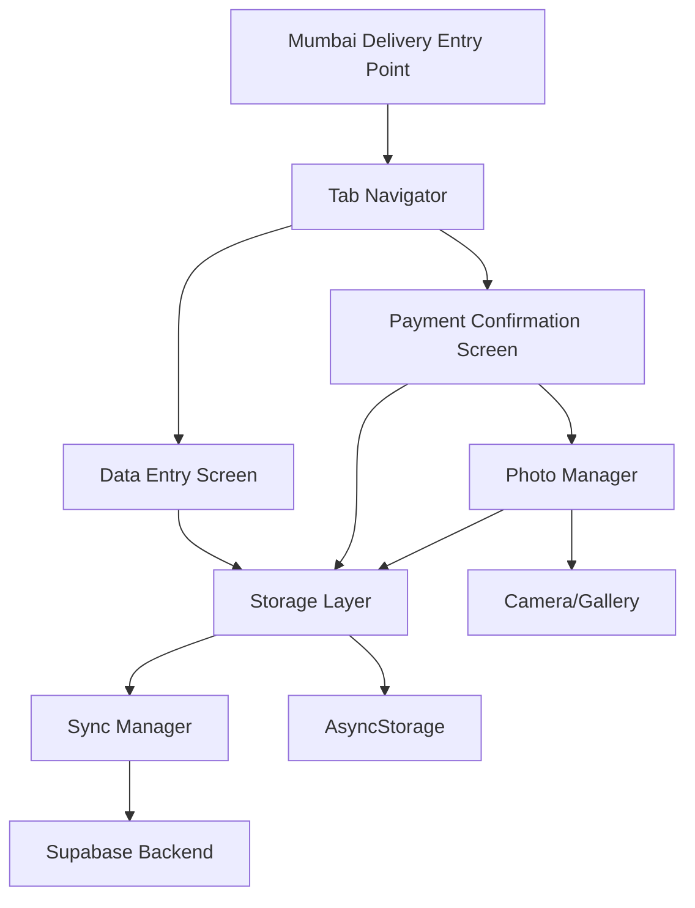

# Design Document: Mumbai Delivery Redesign

## Overview

The Mumbai Delivery redesign transforms the current single-screen delivery entry system into a comprehensive two-screen workflow that manages the complete delivery lifecycle. The redesign introduces:

1. **Data Entry Screen**: Streamlined interface for rapid delivery record creation with four essential fields
2. **Payment Confirmation Screen**: Interactive table view with double-tap confirmation and photo proof capture
3. **Photo Management**: Integrated camera/gallery access for bilty and signature proof with offline support
4. **Status Tracking**: Visual separation of pending and confirmed deliveries with status indicators

The design maintains backward compatibility with existing AgencyEntry data while extending the schema to support the new workflow requirements. All features support offline-first operation with automatic synchronization.

## Architecture

### High-Level Architecture



### Component Hierarchy

```
MumbaiDeliveryNavigator (Tab Navigator)
├── DataEntryScreen
│   ├── DeliveryForm
│   │   ├── TextInput (Billty No)
│   │   ├── TextInput (Consignee Name)
│   │   ├── TextInput (Item Description)
│   │   ├── TextInput (Amount)
│   │   └── SaveButton
│   └── RecentEntriesList (optional preview)
│
└── PaymentConfirmationScreen
    ├── DeliveryTable
    │   ├── PendingDeliveriesSection
    │   │   └── DeliveryRow[] (double-tap enabled)
    │   ├── GreenSeparator
    │   └── ConfirmedDeliveriesSection
    │       └── ConfirmedDeliveryRow[] (with checkmark)
    └── PaymentConfirmationPopup (modal)
        ├── DeliveryDetails
        ├── AmountConfirmationSection
        ├── PhotoUploadSection (Bilty)
        ├── PhotoUploadSection (Signature)
        └── ConfirmButton
```

## Components and Interfaces

### 1. Data Entry Screen Component

**Purpose**: Provide a fast, efficient interface for creating delivery records.

**Props**:
```typescript
interface DataEntryScreenProps {
  navigation: NavigationProp<RootStackParamList, 'MumbaiDeliveryDataEntry'>;
}
```

**State**:
```typescript
interface DataEntryState {
  billtyNo: string;
  consigneeName: string;
  itemDescription: string;
  amount: string;
  saving: boolean;
  recentEntries: DeliveryRecord[];
}
```

**Key Methods**:
- `handleSave()`: Validates and saves delivery record
- `clearForm()`: Resets all input fields
- `validateInputs()`: Validates all required fields

### 2. Payment Confirmation Screen Component

**Purpose**: Display delivery records in table format and handle payment confirmation workflow.

**Props**:
```typescript
interface PaymentConfirmationScreenProps {
  navigation: NavigationProp<RootStackParamList, 'MumbaiDeliveryConfirmation'>;
}
```

**State**:
```typescript
interface PaymentConfirmationState {
  deliveryRecords: DeliveryRecord[];
  loading: boolean;
  refreshing: boolean;
  selectedRecord: DeliveryRecord | null;
  popupVisible: boolean;
}
```

**Key Methods**:
- `loadDeliveryRecords()`: Fetches all delivery records for current office
- `handleDoubleTap(recordId: string)`: Opens confirmation popup
- `handleConfirmPayment(confirmation: PaymentConfirmation)`: Processes payment confirmation
- `separateRecordsByStatus()`: Splits records into pending and confirmed arrays

### 3. Payment Confirmation Popup Component

**Purpose**: Modal interface for confirming payment and capturing proof photos.

**Props**:
```typescript
interface PaymentConfirmationPopupProps {
  visible: boolean;
  deliveryRecord: DeliveryRecord;
  onConfirm: (confirmation: PaymentConfirmation) => Promise<void>;
  onCancel: () => void;
  readOnly?: boolean;
}
```

**State**:
```typescript
interface PopupState {
  confirmedAmount: string;
  biltyPhoto: PhotoData | null;
  signaturePhoto: PhotoData | null;
  confirming: boolean;
}
```

**Key Methods**:
- `handleCapturePhoto(type: 'bilty' | 'signature')`: Opens camera/gallery
- `validateConfirmation()`: Ensures all required data is present
- `submitConfirmation()`: Saves confirmation data

### 4. Photo Manager Service

**Purpose**: Handle photo capture, storage, and synchronization.

**Interface**:
```typescript
interface PhotoManager {
  capturePhoto(options: CaptureOptions): Promise<PhotoData>;
  savePhoto(photo: PhotoData, recordId: string, type: PhotoType): Promise<string>;
  getPhoto(photoId: string): Promise<PhotoData | null>;
  syncPendingPhotos(): Promise<SyncResult>;
}

interface PhotoData {
  uri: string;
  fileName: string;
  fileSize: number;
  mimeType: string;
  timestamp: string;
}

interface CaptureOptions {
  source: 'camera' | 'library';
  quality: number;
  maxWidth?: number;
  maxHeight?: number;
}

type PhotoType = 'bilty' | 'signature';
```

**Key Methods**:
- `capturePhoto()`: Opens camera or photo library
- `savePhoto()`: Stores photo locally and queues for sync
- `getPhoto()`: Retrieves photo from local or remote storage
- `syncPendingPhotos()`: Uploads pending photos to backend

## Data Models

### DeliveryRecord

Extended from AgencyEntry with additional fields for the new workflow:

```typescript
interface DeliveryRecord extends AgencyEntry {
  // New fields
  billty_no: string;
  consignee_name: string;
  item_description: string;
  confirmation_status: 'pending' | 'confirmed';
  confirmed_at?: string;
  confirmed_amount?: number;
  bilty_photo_id?: string;
  signature_photo_id?: string;
  taken_from_godown: boolean;
  payment_received: boolean;
  
  // Existing AgencyEntry fields
  id: string;
  agency_id: string;
  agency_name: string; // Always 'Mumbai'
  description: string; // Maps to item_description
  amount: number;
  entry_type: 'credit' | 'debit';
  entry_date: string;
  office_id?: string;
  office_name?: string;
  created_by?: string;
  created_at: string;
  updated_at: string;
  delivery_status?: 'yes' | 'no';
}
```

### PaymentConfirmation

```typescript
interface PaymentConfirmation {
  delivery_record_id: string;
  confirmed_amount: number;
  bilty_photo: PhotoData;
  signature_photo: PhotoData;
  confirmed_at: string;
  confirmed_by?: string;
}
```

### PhotoRecord

```typescript
interface PhotoRecord {
  id: string;
  delivery_record_id: string;
  photo_type: 'bilty' | 'signature';
  file_path: string; // Local path or remote URL
  file_name: string;
  file_size: number;
  mime_type: string;
  uploaded: boolean;
  upload_url?: string;
  office_id?: string;
  created_at: string;
  updated_at: string;
}
```

### Database Schema Changes

**New Table: delivery_photos**
```sql
CREATE TABLE delivery_photos (
  id UUID PRIMARY KEY DEFAULT uuid_generate_v4(),
  delivery_record_id UUID NOT NULL REFERENCES agency_entries(id) ON DELETE CASCADE,
  photo_type TEXT NOT NULL CHECK (photo_type IN ('bilty', 'signature')),
  file_path TEXT NOT NULL,
  file_name TEXT NOT NULL,
  file_size INTEGER NOT NULL,
  mime_type TEXT NOT NULL,
  uploaded BOOLEAN DEFAULT FALSE,
  upload_url TEXT,
  office_id UUID REFERENCES offices(id),
  created_by UUID REFERENCES auth.users(id),
  created_at TIMESTAMP WITH TIME ZONE DEFAULT NOW(),
  updated_at TIMESTAMP WITH TIME ZONE DEFAULT NOW()
);

CREATE INDEX idx_delivery_photos_record_id ON delivery_photos(delivery_record_id);
CREATE INDEX idx_delivery_photos_office_id ON delivery_photos(office_id);
```

**Extended Table: agency_entries**
```sql
ALTER TABLE agency_entries ADD COLUMN IF NOT EXISTS billty_no TEXT;
ALTER TABLE agency_entries ADD COLUMN IF NOT EXISTS consignee_name TEXT;
ALTER TABLE agency_entries ADD COLUMN IF NOT EXISTS item_description TEXT;
ALTER TABLE agency_entries ADD COLUMN IF NOT EXISTS confirmation_status TEXT DEFAULT 'pending' CHECK (confirmation_status IN ('pending', 'confirmed'));
ALTER TABLE agency_entries ADD COLUMN IF NOT EXISTS confirmed_at TIMESTAMP WITH TIME ZONE;
ALTER TABLE agency_entries ADD COLUMN IF NOT EXISTS confirmed_amount NUMERIC(10, 2);
ALTER TABLE agency_entries ADD COLUMN IF NOT EXISTS bilty_photo_id UUID REFERENCES delivery_photos(id);
ALTER TABLE agency_entries ADD COLUMN IF NOT EXISTS signature_photo_id UUID REFERENCES delivery_photos(id);
ALTER TABLE agency_entries ADD COLUMN IF NOT EXISTS taken_from_godown BOOLEAN DEFAULT FALSE;
ALTER TABLE agency_entries ADD COLUMN IF NOT EXISTS payment_received BOOLEAN DEFAULT FALSE;

CREATE INDEX idx_agency_entries_billty_no ON agency_entries(billty_no);
CREATE INDEX idx_agency_entries_confirmation_status ON agency_entries(confirmation_status);
```

## Storage Layer Extensions

### New Storage Functions

```typescript
// Save delivery record with new fields
export const saveDeliveryRecord = async (
  record: Partial<DeliveryRecord>
): Promise<boolean> => {
  // Implementation handles both online and offline scenarios
  // Validates required fields
  // Associates with current office
  // Queues for sync if offline
}

// Get delivery records filtered by office and status
export const getDeliveryRecords = async (
  officeId?: string,
  status?: 'pending' | 'confirmed' | 'all'
): Promise<DeliveryRecord[]> => {
  // Fetches from Supabase if online
  // Falls back to AsyncStorage if offline
  // Applies office and status filters
}

// Confirm payment for a delivery record
export const confirmDeliveryPayment = async (
  confirmation: PaymentConfirmation
): Promise<boolean> => {
  // Updates delivery record with confirmation data
  // Saves photo records
  // Marks as confirmed
  // Queues for sync if offline
}

// Save photo record
export const savePhotoRecord = async (
  photo: Partial<PhotoRecord>
): Promise<string> => {
  // Saves photo metadata to database
  // Stores photo file locally
  // Queues for upload if offline
  // Returns photo ID
}

// Get photos for a delivery record
export const getDeliveryPhotos = async (
  deliveryRecordId: string
): Promise<PhotoRecord[]> => {
  // Fetches photo records for a delivery
  // Returns both bilty and signature photos
}
```

### Offline Storage Keys

```typescript
export const OFFLINE_KEYS = {
  // Existing keys...
  DELIVERY_RECORDS: 'offline_delivery_records',
  DELIVERY_PHOTOS: 'offline_delivery_photos',
  PENDING_PHOTO_UPLOADS: 'pending_photo_uploads',
};
```

## Photo Upload Strategy

### Local Storage

Photos are stored locally using React Native's file system:
- Path: `${DocumentDirectoryPath}/delivery_photos/${recordId}/${photoType}_${timestamp}.jpg`
- Compressed to reduce size (quality: 0.7, maxWidth: 1920)
- Metadata stored in AsyncStorage

### Upload Process

1. **Immediate Save**: Photo saved locally when captured
2. **Queue for Upload**: Photo metadata added to upload queue
3. **Background Upload**: When online, photos uploaded to Supabase Storage
4. **Update Record**: Photo URL updated in database after successful upload
5. **Retry Logic**: Failed uploads retried with exponential backoff

### Supabase Storage Bucket

```typescript
// Bucket configuration
const DELIVERY_PHOTOS_BUCKET = 'delivery-photos';

// Upload path structure
// {office_id}/{delivery_record_id}/{photo_type}_{timestamp}.jpg

// Example:
// abc123-office/def456-record/bilty_20240115120000.jpg
```

