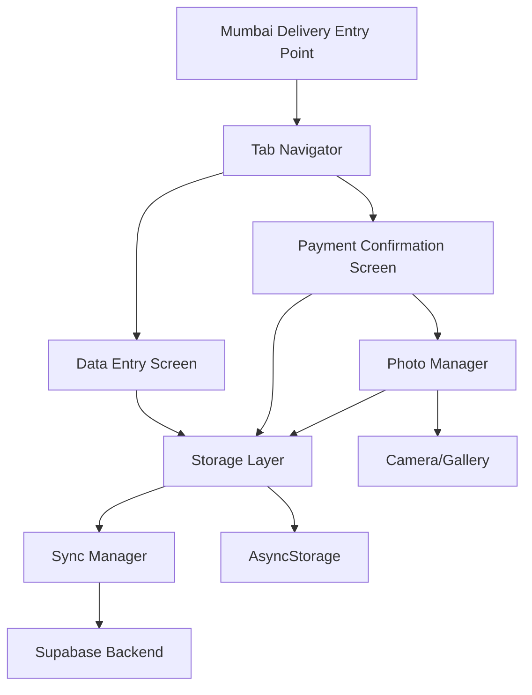

# Design Document: Mumbai Delivery Redesign

## Overview

The Mumbai Delivery redesign transforms the current single-screen delivery entry system into a comprehensive two-screen workflow that manages the complete delivery lifecycle. The redesign introduces:

1. **Data Entry Screen**: Streamlined interface for rapid delivery record creation with four essential fields
2. **Payment Confirmation Screen**: Interactive table view with double-tap confirmation and photo proof capture
3. **Photo Management**: Integrated camera/gallery access for bilty and signature proof with offline support
4. **Status Tracking**: Visual separation of pending and confirmed deliveries with status indicators

The design maintains backward compatibility with existing AgencyEntry data while extending the schema to support the new workflow requirements. All features support offline-first operation with automatic synchronization.

## Architecture

### High-Level Architecture



### Component Hierarchy

```
MumbaiDeliveryNavigator (Tab Navigator)
├── DataEntryScreen
│   ├── DeliveryForm
│   │   ├── TextInput (Billty No)
│   │   ├── TextInput (Consignee Name)
│   │   ├── TextInput (Item Description)
│   │   ├── TextInput (Amount)
│   │   └── SaveButton
│   └── RecentEntriesList (optional preview)
│
└── PaymentConfirmationScreen
    ├── DeliveryTable
    │   ├── PendingDeliveriesSection
    │   │   └── DeliveryRow[] (double-tap enabled)
    │   ├── GreenSeparator
    │   └── ConfirmedDeliveriesSection
    │       └── ConfirmedDeliveryRow[] (with checkmark)
    └── PaymentConfirmationPopup (modal)
        ├── DeliveryDetails
        ├── AmountConfirmationSection
        ├── PhotoUploadSection (Bilty)
        ├── PhotoUploadSection (Signature)
        └── ConfirmButton
```

## Components and Interfaces

### 1. Data Entry Screen Component

**Purpose**: Provide a fast, efficient interface for creating delivery records.

**Props**:
```typescript
interface DataEntryScreenProps {
  navigation: NavigationProp<RootStackParamList, 'MumbaiDeliveryDataEntry'>;
}
```

**State**:
```typescript
interface DataEntryState {
  billtyNo: string;
  consigneeName: string;
  itemDescription: string;
  amount: string;
  saving: boolean;
  recentEntries: DeliveryRecord[];
}
```

**Key Methods**:
- `handleSave()`: Validates and saves delivery record
- `clearForm()`: Resets all input fields
- `validateInputs()`: Validates all required fields

### 2. Payment Confirmation Screen Component

**Purpose**: Display delivery records in table format and handle payment confirmation workflow.

**Props**:
```typescript
interface PaymentConfirmationScreenProps {
  navigation: NavigationProp<RootStackParamList, 'MumbaiDeliveryConfirmation'>;
}
```

**State**:
```typescript
interface PaymentConfirmationState {
  deliveryRecords: DeliveryRecord[];
  loading: boolean;
  refreshing: boolean;
  selectedRecord: DeliveryRecord | null;
  popupVisible: boolean;
}
```

**Key Methods**:
- `loadDeliveryRecords()`: Fetches all delivery records for current office
- `handleDoubleTap(recordId: string)`: Opens confirmation popup
- `handleConfirmPayment(confirmation: PaymentConfirmation)`: Processes payment confirmation
- `separateRecordsByStatus()`: Splits records into pending and confirmed arrays

### 3. Payment Confirmation Popup Component

**Purpose**: Modal interface for confirming payment and capturing proof photos.

**Props**:
```typescript
interface PaymentConfirmationPopupProps {
  visible: boolean;
  deliveryRecord: DeliveryRecord;
  onConfirm: (confirmation: PaymentConfirmation) => Promise<void>;
  onCancel: () => void;
  readOnly?: boolean;
}
```

**State**:
```typescript
interface PopupState {
  confirmedAmount: string;
  biltyPhoto: PhotoData | null;
  signaturePhoto: PhotoData | null;
  confirming: boolean;
}
```

**Key Methods**:
- `handleCapturePhoto(type: 'bilty' | 'signature')`: Opens camera/gallery
- `validateConfirmation()`: Ensures all required data is present
- `submitConfirmation()`: Saves confirmation data

### 4. Photo Manager Service

**Purpose**: Handle photo capture, storage, and synchronization.

**Interface**:
```typescript
interface PhotoManager {
  capturePhoto(options: CaptureOptions): Promise<PhotoData>;
  savePhoto(photo: PhotoData, recordId: string, type: PhotoType): Promise<string>;
  getPhoto(photoId: string): Promise<PhotoData | null>;
  syncPendingPhotos(): Promise<SyncResult>;
}

interface PhotoData {
  uri: string;
  fileName: string;
  fileSize: number;
  mimeType: string;
  timestamp: string;
}

interface CaptureOptions {
  source: 'camera' | 'library';
  quality: number;
  maxWidth?: number;
  maxHeight?: number;
}

type PhotoType = 'bilty' | 'signature';
```

**Key Methods**:
- `capturePhoto()`: Opens camera or photo library
- `savePhoto()`: Stores photo locally and queues for sync
- `getPhoto()`: Retrieves photo from local or remote storage
- `syncPendingPhotos()`: Uploads pending photos to backend

## Data Models

### DeliveryRecord

Extended from AgencyEntry with additional fields for the new workflow:

```typescript
interface DeliveryRecord extends AgencyEntry {
  // New fields
  billty_no: string;
  consignee_name: string;
  item_description: string;
  confirmation_status: 'pending' | 'confirmed';
  confirmed_at?: string;
  confirmed_amount?: number;
  bilty_photo_id?: string;
  signature_photo_id?: string;
  taken_from_godown: boolean;
  payment_received: boolean;
  
  // Existing AgencyEntry fields
  id: string;
  agency_id: string;
  agency_name: string; // Always 'Mumbai'
  description: string; // Maps to item_description
  amount: number;
  entry_type: 'credit' | 'debit';
  entry_date: string;
  office_id?: string;
  office_name?: string;
  created_by?: string;
  created_at: string;
  updated_at: string;
  delivery_status?: 'yes' | 'no';
}
```

### PaymentConfirmation

```typescript
interface PaymentConfirmation {
  delivery_record_id: string;
  confirmed_amount: number;
  bilty_photo: PhotoData;
  signature_photo: PhotoData;
  confirmed_at: string;
  confirmed_by?: string;
}
```

### PhotoRecord

```typescript
interface PhotoRecord {
  id: string;
  delivery_record_id: string;
  photo_type: 'bilty' | 'signature';
  file_path: string; // Local path or remote URL
  file_name: string;
  file_size: number;
  mime_type: string;
  uploaded: boolean;
  upload_url?: string;
  office_id?: string;
  created_at: string;
  updated_at: string;
}
```

### Database Schema Changes

**New Table: delivery_photos**
```sql
CREATE TABLE delivery_photos (
  id UUID PRIMARY KEY DEFAULT uuid_generate_v4(),
  delivery_record_id UUID NOT NULL REFERENCES agency_entries(id) ON DELETE CASCADE,
  photo_type TEXT NOT NULL CHECK (photo_type IN ('bilty', 'signature')),
  file_path TEXT NOT NULL,
  file_name TEXT NOT NULL,
  file_size INTEGER NOT NULL,
  mime_type TEXT NOT NULL,
  uploaded BOOLEAN DEFAULT FALSE,
  upload_url TEXT,
  office_id UUID REFERENCES offices(id),
  created_by UUID REFERENCES auth.users(id),
  created_at TIMESTAMP WITH TIME ZONE DEFAULT NOW(),
  updated_at TIMESTAMP WITH TIME ZONE DEFAULT NOW()
);

CREATE INDEX idx_delivery_photos_record_id ON delivery_photos(delivery_record_id);
CREATE INDEX idx_delivery_photos_office_id ON delivery_photos(office_id);
```

**Extended Table: agency_entries**
```sql
ALTER TABLE agency_entries ADD COLUMN IF NOT EXISTS billty_no TEXT;
ALTER TABLE agency_entries ADD COLUMN IF NOT EXISTS consignee_name TEXT;
ALTER TABLE agency_entries ADD COLUMN IF NOT EXISTS item_description TEXT;
ALTER TABLE agency_entries ADD COLUMN IF NOT EXISTS confirmation_status TEXT DEFAULT 'pending' CHECK (confirmation_status IN ('pending', 'confirmed'));
ALTER TABLE agency_entries ADD COLUMN IF NOT EXISTS confirmed_at TIMESTAMP WITH TIME ZONE;
ALTER TABLE agency_entries ADD COLUMN IF NOT EXISTS confirmed_amount NUMERIC(10, 2);
ALTER TABLE agency_entries ADD COLUMN IF NOT EXISTS bilty_photo_id UUID REFERENCES delivery_photos(id);
ALTER TABLE agency_entries ADD COLUMN IF NOT EXISTS signature_photo_id UUID REFERENCES delivery_photos(id);
ALTER TABLE agency_entries ADD COLUMN IF NOT EXISTS taken_from_godown BOOLEAN DEFAULT FALSE;
ALTER TABLE agency_entries ADD COLUMN IF NOT EXISTS payment_received BOOLEAN DEFAULT FALSE;

CREATE INDEX idx_agency_entries_billty_no ON agency_entries(billty_no);
CREATE INDEX idx_agency_entries_confirmation_status ON agency_entries(confirmation_status);
```

## Storage Layer Extensions

### New Storage Functions

```typescript
// Save delivery record with new fields
export const saveDeliveryRecord = async (
  record: Partial<DeliveryRecord>
): Promise<boolean> => {
  // Implementation handles both online and offline scenarios
  // Validates required fields
  // Associates with current office
  // Queues for sync if offline
}

// Get delivery records filtered by office and status
export const getDeliveryRecords = async (
  officeId?: string,
  status?: 'pending' | 'confirmed' | 'all'
): Promise<DeliveryRecord[]> => {
  // Fetches from Supabase if online
  // Falls back to AsyncStorage if offline
  // Applies office and status filters
}

// Confirm payment for a delivery record
export const confirmDeliveryPayment = async (
  confirmation: PaymentConfirmation
): Promise<boolean> => {
  // Updates delivery record with confirmation data
  // Saves photo records
  // Marks as confirmed
  // Queues for sync if offline
}

// Save photo record
export const savePhotoRecord = async (
  photo: Partial<PhotoRecord>
): Promise<string> => {
  // Saves photo metadata to database
  // Stores photo file locally
  // Queues for upload if offline
  // Returns photo ID
}

// Get photos for a delivery record
export const getDeliveryPhotos = async (
  deliveryRecordId: string
): Promise<PhotoRecord[]> => {
  // Fetches photo records for a delivery
  // Returns both bilty and signature photos
}
```

### Offline Storage Keys

```typescript
export const OFFLINE_KEYS = {
  // Existing keys...
  DELIVERY_RECORDS: 'offline_delivery_records',
  DELIVERY_PHOTOS: 'offline_delivery_photos',
  PENDING_PHOTO_UPLOADS: 'pending_photo_uploads',
};
```

## Photo Upload Strategy

### Local Storage

Photos are stored locally using React Native's file system:
- Path: `${DocumentDirectoryPath}/delivery_photos/${recordId}/${photoType}_${timestamp}.jpg`
- Compressed to reduce size (quality: 0.7, maxWidth: 1920)
- Metadata stored in AsyncStorage

### Upload Process

1. **Immediate Save**: Photo saved locally when captured
2. **Queue for Upload**: Photo metadata added to upload queue
3. **Background Upload**: When online, photos uploaded to Supabase Storage
4. **Update Record**: Photo URL updated in database after successful upload
5. **Retry Logic**: Failed uploads retried with exponential backoff

### Supabase Storage Bucket

```typescript
// Bucket configuration
const DELIVERY_PHOTOS_BUCKET = 'delivery-photos';

// Upload path structure
// {office_id}/{delivery_record_id}/{photo_type}_{timestamp}.jpg

// Example:
// abc123-office/def456-record/bilty_20240115120000.jpg
```


## Correctness Properties

A property is a characteristic or behavior that should hold true across all valid executions of a system—essentially, a formal statement about what the system should do. Properties serve as the bridge between human-readable specifications and machine-verifiable correctness guarantees.

### Property Reflection

After analyzing all acceptance criteria, I identified several areas where properties can be consolidated:

- **Input Validation Properties (1.3, 1.4, 1.5)**: These can be combined into a comprehensive input validation property
- **Confirmation Status Properties (3.7, 3.8, 3.9, 5.1, 5.2)**: These describe the same state transition and can be combined
- **Office Association Properties (1.8, 7.1, 7.5)**: These all verify office_id is correctly set and maintained
- **Display Ordering Properties (2.2, 3.8)**: Both verify that confirmed records appear after pending records

### Core Properties

**Property 1: Input Validation Completeness**

*For any* delivery record submission, if any required field (Billty No, Consignee Name, Item Description, or Amount) is empty or invalid (Amount must be positive), then the system should reject the submission and display an appropriate field-specific error message.

**Validates: Requirements 1.3, 1.4, 1.5, 10.1**

---

**Property 2: Save Button State Consistency**

*For any* form state, the save button should be enabled if and only if all required fields contain valid data.

**Validates: Requirements 1.2**

---

**Property 3: New Record Initial State**

*For any* successfully saved delivery record, the record should have confirmation_status='pending', taken_from_godown=false, and payment_received=false.

**Validates: Requirements 1.6**

---

**Property 4: Form Reset After Save**

*For any* successful save operation, all input fields (Billty No, Consignee Name, Item Description, Amount) should be cleared to empty strings.

**Validates: Requirements 1.7**

---

**Property 5: Office Association Persistence**

*For any* delivery record created or synced, the record's office_id should match the current active office and should remain unchanged during sync operations.

**Validates: Requirements 1.8, 7.1, 7.5**

---

**Property 6: Record Display Ordering**

*For any* list of delivery records, pending records should appear before confirmed records, and within each group, records should be ordered by entry_date descending.

**Validates: Requirements 2.2, 3.8**

---

**Property 7: Sequential Index Numbering**

*For any* displayed list of N delivery records, the Index No column should contain sequential integers from 1 to N without gaps or duplicates.

**Validates: Requirements 2.5**

---

**Property 8: Confirmation State Transition Completeness**

*For any* delivery record that undergoes payment confirmation with valid data (confirmed amount and both photos), the record should transition to confirmation_status='confirmed', taken_from_godown=true, payment_received=true, and should have confirmed_at timestamp, bilty_photo_id, and signature_photo_id populated.

**Validates: Requirements 3.7, 3.9, 5.1, 5.2**

---

**Property 9: Confirmed Record Visual Indicators**

*For any* delivery record with confirmation_status='confirmed', the display should include a checkmark indicator and the record should appear below the green separator line.

**Validates: Requirements 2.4, 3.9**

---

**Property 10: Photo File Type Validation**

*For any* file selected for photo upload, if the file's MIME type is not an image format (image/jpeg, image/png, image/jpg), then the system should reject the file and display an error message.

**Validates: Requirements 4.4**

---

**Property 11: Photo Storage Persistence**

*For any* photo successfully captured and associated with a delivery record, the photo should be stored in local storage and retrievable by its photo_id.

**Validates: Requirements 4.5**

---

**Property 12: Office-Based Record Filtering**

*For any* query for delivery records with a specified office_id, the returned results should contain only records where the record's office_id matches the query parameter, and no records from other offices should be included.

**Validates: Requirements 7.2, 7.4**

---

**Property 13: Data Migration Field Mapping**

*For any* existing AgencyEntry record with agency_name='Mumbai', when migrated to the new schema, the description field should be mapped to item_description, and any missing required fields (billty_no, consignee_name) should be populated with placeholder values.

**Validates: Requirements 8.2, 8.3**

---

**Property 14: Duplicate Billty Number Detection**

*For any* delivery record submission with a billty_no that already exists in the current office's records, the system should display a warning message indicating the duplicate.

**Validates: Requirements 10.5**

---

**Property 15: Delivery Statistics Accuracy**

*For any* set of delivery records, the count of pending deliveries should equal the number of records with confirmation_status='pending', and the count of confirmed deliveries should equal the number of records with confirmation_status='confirmed'.

**Validates: Requirements 5.4**

---

## Error Handling

### Validation Errors

**Input Validation**:
- Empty required fields: Display field-specific error (e.g., "Billty No is required")
- Invalid amount: Display "Enter valid amount"
- Duplicate billty number: Display "Warning: Billty No already exists for this office"

**Photo Validation**:
- Invalid file type: Display "Please select an image file (JPG or PNG)"
- File too large: Display "Photo file size must be less than 5MB"
- Missing photos on confirmation: Display "Please upload both bilty and signature photos"

### Network Errors

**Offline Mode**:
- All operations save to local storage
- Display toast: "Working offline - data will sync when connected"
- Queue all operations for sync

**Sync Failures**:
- Display: "Sync failed, data saved locally"
- Retry with exponential backoff (1s, 2s, 4s, 8s, max 30s)
- Log sync conflicts for admin review

**Photo Upload Failures**:
- Display: "Photo upload failed, will retry"
- Queue photo for retry
- Show upload status indicator in UI

### Data Integrity Errors

**Office Mismatch**:
- If record's office_id doesn't match current office during sync
- Attempt to resolve using default office
- Log conflict for admin review

**Missing References**:
- If photo_id references non-existent photo
- Display placeholder image
- Log error for investigation

### User-Facing Error Messages

All errors use the existing AlertContext with consistent messaging:

```typescript
// Validation errors
showAlert('Billty No is required');
showAlert('Consignee Name is required');
showAlert('Item Description is required');
showAlert('Enter valid amount');

// Photo errors
showAlert('Please select an image file (JPG or PNG)');
showAlert('Photo file size must be less than 5MB');
showAlert('Please upload both bilty and signature photos');

// Network errors
showAlert('Working offline - data will sync when connected');
showAlert('Sync failed, data saved locally');
showAlert('Photo upload failed, will retry');

// Duplicate detection
showAlert('Warning: Billty No already exists for this office');
```

## Testing Strategy

### Dual Testing Approach

The testing strategy employs both unit tests and property-based tests to ensure comprehensive coverage:

- **Unit Tests**: Verify specific examples, edge cases, error conditions, and integration points
- **Property Tests**: Verify universal properties across all inputs through randomization

Both approaches are complementary and necessary for comprehensive correctness validation.

### Property-Based Testing

**Library**: fast-check (for TypeScript/React Native)

**Configuration**:
- Minimum 100 iterations per property test
- Each test tagged with feature name and property number
- Tag format: `Feature: mumbai-delivery-redesign, Property {N}: {property_text}`

**Property Test Coverage**:

1. **Property 1 - Input Validation**: Generate random delivery records with various combinations of empty/invalid fields, verify rejection
2. **Property 2 - Save Button State**: Generate random form states, verify button enabled state matches field validity
3. **Property 3 - New Record Initial State**: Generate random valid delivery records, verify initial status flags
4. **Property 4 - Form Reset**: Generate random form states, save, verify all fields cleared
5. **Property 5 - Office Association**: Generate random delivery records with various office contexts, verify office_id consistency
6. **Property 6 - Record Ordering**: Generate random sets of pending and confirmed records, verify ordering
7. **Property 7 - Sequential Indexing**: Generate random lists of records, verify index sequence
8. **Property 8 - Confirmation Transition**: Generate random confirmation actions, verify complete state transition
9. **Property 9 - Visual Indicators**: Generate random confirmed records, verify checkmark and separator
10. **Property 10 - Photo Validation**: Generate random file types, verify only images accepted
11. **Property 11 - Photo Storage**: Generate random photos, verify storage and retrieval
12. **Property 12 - Office Filtering**: Generate random records across multiple offices, verify filtering
13. **Property 13 - Data Migration**: Generate random legacy records, verify field mapping
14. **Property 14 - Duplicate Detection**: Generate random records with duplicate billty numbers, verify warning
15. **Property 15 - Statistics Accuracy**: Generate random record sets, verify counts

### Unit Testing

**Focus Areas**:
- Component rendering (screens, popups, forms)
- Navigation flow between screens
- Double-tap gesture handling
- Photo capture integration
- Offline/online mode switching
- Sync manager operation
- Error message display
- AlertContext integration

**Example Unit Tests**:

```typescript
// Data Entry Screen
describe('DataEntryScreen', () => {
  it('should render all four input fields', () => {
    // Validates: Requirement 1.1
  });
  
  it('should navigate to confirmation screen when button pressed', () => {
    // Validates: Requirement 9.2
  });
  
  it('should display specific error for invalid amount', () => {
    // Validates: Requirement 10.2
  });
});

// Payment Confirmation Screen
describe('PaymentConfirmationScreen', () => {
  it('should display table with required columns', () => {
    // Validates: Requirement 2.1
  });
  
  it('should show green separator between sections', () => {
    // Validates: Requirement 2.3
  });
  
  it('should open popup on double-tap', () => {
    // Validates: Requirement 3.1
  });
  
  it('should fetch records for current office on load', () => {
    // Validates: Requirement 2.6
  });
});

// Payment Confirmation Popup
describe('PaymentConfirmationPopup', () => {
  it('should display delivery record details', () => {
    // Validates: Requirement 3.2
  });
  
  it('should include amount confirmation section', () => {
    // Validates: Requirement 3.3
  });
  
  it('should include bilty photo upload section', () => {
    // Validates: Requirement 3.4
  });
  
  it('should include signature photo upload section', () => {
    // Validates: Requirement 3.5
  });
  
  it('should warn when confirming without photos', () => {
    // Validates: Requirement 3.6
  });
  
  it('should display in read-only mode for confirmed records', () => {
    // Validates: Requirement 3.10
  });
});

// Photo Manager
describe('PhotoManager', () => {
  it('should open camera when bilty photo tapped', () => {
    // Validates: Requirement 4.1
  });
  
  it('should open camera when signature photo tapped', () => {
    // Validates: Requirement 4.2
  });
  
  it('should display thumbnail after capture', () => {
    // Validates: Requirement 4.3
  });
  
  it('should sync photos when online', () => {
    // Validates: Requirement 4.6
  });
  
  it('should queue failed uploads for retry', () => {
    // Validates: Requirement 4.7
  });
});

// Offline Support
describe('Offline Support', () => {
  it('should save delivery records locally when offline', () => {
    // Validates: Requirement 6.1
  });
  
  it('should save photos locally when offline', () => {
    // Validates: Requirement 6.2
  });
  
  it('should save confirmations locally when offline', () => {
    // Validates: Requirement 6.3
  });
  
  it('should sync pending records when online', () => {
    // Validates: Requirement 6.4
  });
  
  it('should sync pending photos when online', () => {
    // Validates: Requirement 6.5
  });
  
  it('should sync pending confirmations when online', () => {
    // Validates: Requirement 6.6
  });
  
  it('should queue failed syncs for retry', () => {
    // Validates: Requirement 6.7
  });
});

// Multi-Office Support
describe('Multi-Office Support', () => {
  it('should display only current office records after switch', () => {
    // Validates: Requirement 7.3
  });
});

// Data Migration
describe('Data Migration', () => {
  it('should maintain compatibility with AgencyEntry', () => {
    // Validates: Requirement 8.1
  });
  
  it('should preserve all Mumbai records', () => {
    // Validates: Requirement 8.4
  });
  
  it('should indicate migrated data fields', () => {
    // Validates: Requirement 8.5
  });
});

// Navigation
describe('Navigation', () => {
  it('should provide navigation controls', () => {
    // Validates: Requirement 9.1
  });
  
  it('should maintain screen state when backgrounded', () => {
    // Validates: Requirement 9.4
  });
  
  it('should configure gesture handlers', () => {
    // Validates: Requirement 9.6
  });
});

// Error Handling
describe('Error Handling', () => {
  it('should use AlertContext for errors', () => {
    // Validates: Requirement 10.6
  });
  
  it('should log all errors', () => {
    // Validates: Requirement 10.7
  });
});

// Status Persistence
describe('Status Persistence', () => {
  it('should persist delivery status across restarts', () => {
    // Validates: Requirement 5.5
  });
});
```

### Integration Testing

**Focus Areas**:
- End-to-end workflow: Create record → Confirm payment → Verify status
- Photo capture → Storage → Upload → Retrieval flow
- Offline → Online transition with sync
- Office switching with data isolation

### Test Data Generators

For property-based testing, implement generators for:

```typescript
// Generate random delivery records
const deliveryRecordArbitrary = fc.record({
  billty_no: fc.string({ minLength: 1, maxLength: 20 }),
  consignee_name: fc.string({ minLength: 1, maxLength: 50 }),
  item_description: fc.string({ minLength: 1, maxLength: 100 }),
  amount: fc.float({ min: 0.01, max: 1000000 }),
  confirmation_status: fc.constantFrom('pending', 'confirmed'),
  office_id: fc.uuid(),
});

// Generate random photo data
const photoDataArbitrary = fc.record({
  uri: fc.webUrl(),
  fileName: fc.string({ minLength: 5, maxLength: 50 }),
  fileSize: fc.integer({ min: 1000, max: 5000000 }),
  mimeType: fc.constantFrom('image/jpeg', 'image/png', 'image/jpg'),
});

// Generate random form states
const formStateArbitrary = fc.record({
  billtyNo: fc.option(fc.string(), { nil: '' }),
  consigneeName: fc.option(fc.string(), { nil: '' }),
  itemDescription: fc.option(fc.string(), { nil: '' }),
  amount: fc.option(fc.string(), { nil: '' }),
});
```

## Implementation Notes

### Navigation Structure

The redesign uses React Navigation's Tab Navigator for the two-screen workflow:

```typescript
const MumbaiDeliveryTabs = createMaterialTopTabNavigator();

function MumbaiDeliveryNavigator() {
  return (
    <MumbaiDeliveryTabs.Navigator>
      <MumbaiDeliveryTabs.Screen 
        name="DataEntry" 
        component={DataEntryScreen}
        options={{ title: 'New Delivery' }}
      />
      <MumbaiDeliveryTabs.Screen 
        name="Confirmation" 
        component={PaymentConfirmationScreen}
        options={{ title: 'Confirm Payment' }}
      />
    </MumbaiDeliveryTabs.Navigator>
  );
}
```

### Photo Library Integration

Use `react-native-image-picker` for camera and gallery access:

```typescript
import { launchCamera, launchImageLibrary } from 'react-native-image-picker';

const capturePhoto = async (source: 'camera' | 'library'): Promise<PhotoData> => {
  const options = {
    mediaType: 'photo',
    quality: 0.7,
    maxWidth: 1920,
    maxHeight: 1920,
  };
  
  const result = source === 'camera' 
    ? await launchCamera(options)
    : await launchImageLibrary(options);
    
  // Process result...
};
```

### Gesture Handler Configuration

Use `react-native-gesture-handler` for double-tap:

```typescript
import { TapGestureHandler } from 'react-native-gesture-handler';

<TapGestureHandler
  numberOfTaps={2}
  onActivated={() => handleDoubleTap(record.id)}
>
  <View style={styles.deliveryRow}>
    {/* Row content */}
  </View>
</TapGestureHandler>
```

### Backward Compatibility Strategy

To maintain compatibility with existing code:

1. Keep `MumbaiDeliveryEntryScreen.tsx` as legacy entry point
2. Create new screens: `DataEntryScreen.tsx`, `PaymentConfirmationScreen.tsx`
3. Update navigation to use new `MumbaiDeliveryNavigator`
4. Extend `AgencyEntry` interface with optional new fields
5. Storage functions handle both old and new schema

### Migration Script

Create a one-time migration script to populate new fields for existing records:

```typescript
const migrateExistingMumbaiRecords = async () => {
  const existingRecords = await getAgencyEntry();
  const mumbaiRecords = existingRecords.filter(r => r.agency_name === 'Mumbai');
  
  for (const record of mumbaiRecords) {
    if (!record.billty_no) {
      await updateAgencyEntry(record.id, {
        billty_no: `MIGRATED-${record.id.slice(0, 8)}`,
        consignee_name: 'Legacy Record',
        item_description: record.description,
        confirmation_status: record.delivery_status === 'yes' ? 'confirmed' : 'pending',
        taken_from_godown: record.delivery_status === 'yes',
        payment_received: record.delivery_status === 'yes',
      });
    }
  }
};
```

## Performance Considerations

### List Rendering Optimization

Use `FlatList` with proper optimization:

```typescript
<FlatList
  data={deliveryRecords}
  renderItem={renderDeliveryRow}
  keyExtractor={(item) => item.id}
  getItemLayout={(data, index) => ({
    length: ROW_HEIGHT,
    offset: ROW_HEIGHT * index,
    index,
  })}
  removeClippedSubviews={true}
  maxToRenderPerBatch={10}
  windowSize={10}
/>
```

### Photo Compression

Compress photos before storage to reduce size:

```typescript
const compressPhoto = async (uri: string): Promise<string> => {
  return await ImageResizer.createResizedImage(
    uri,
    1920,  // maxWidth
    1920,  // maxHeight
    'JPEG',
    70,    // quality
  );
};
```

### Sync Batching

Batch sync operations to reduce network calls:

```typescript
const syncBatch = async (records: DeliveryRecord[]) => {
  const BATCH_SIZE = 50;
  for (let i = 0; i < records.length; i += BATCH_SIZE) {
    const batch = records.slice(i, i + BATCH_SIZE);
    await supabase.from('agency_entries').upsert(batch);
  }
};
```

## Security Considerations

### Photo Storage Security

- Photos stored in app's private directory (not accessible to other apps)
- Photo URLs use signed URLs with expiration
- RLS policies enforce office-based access control

### Data Access Control

- All queries filtered by office_id
- RLS policies prevent cross-office data access
- User authentication required for all operations

### Input Sanitization

- Validate and sanitize all text inputs
- Prevent SQL injection through parameterized queries
- Validate file types and sizes for photos
